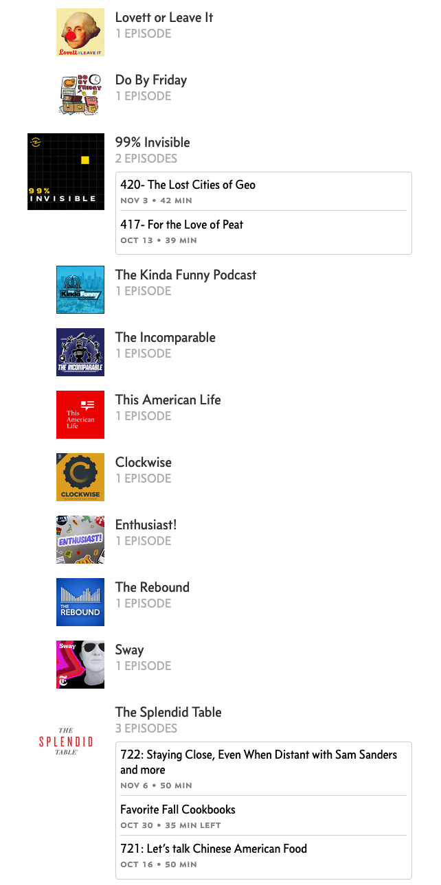

# Better overcast.fm

Make the "Active Podcasts" lists on Overcast.fm a bit easier to navigate by grouping episodes by podcast and making each episode list collapsible.

If you have some podcasts with too many episodes taking over the page give this extension a try.

Now available on the [Firefox add-ons directory](https://addons.mozilla.org/en-US/firefox/addon/better-overcast/).

